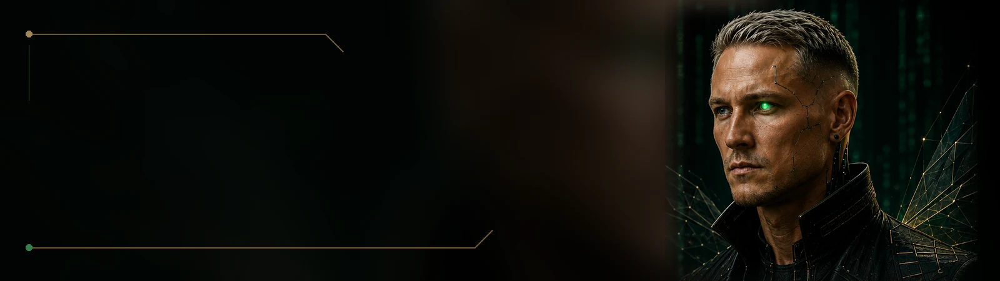

**English** · [Deutsch](README_DE.md) · [Русский](README_RU.md)

# PROM3THEX

### Human intent → Machine intelligence

**AI Systems Architect · Promptrepreneur**

## About

PROM3THEX explores and builds at the intersection of human intention and artificial intelligence—across agents, automation, interfaces, and the ways human behavior shapes interaction with intelligent systems.

## Current Focus

- AI Agents
- Prompt Architecture
- Automation
- Human–AI Interfaces
- Experimental AI Systems

## PROM3THEX Lab

PROM3THEX Lab is a space for experiments, research, prototypes, and open exploration: a place to test ideas, learn from them, and shape them into clearer systems.

## Current Experiment

### Scout Bee — Concept

**Status: Concept / experiment**

Scout Bee is a personal intelligence radar intended to search information sources, filter noise, identify meaningful signal, and eventually track what changed since previous research.

**Find signal in the noise.**

## Entrepreneurship

**Founder — My Ink Chronicles**

My Ink Chronicles is a tattoo studio in Germany. Building businesses in the physical world and systems in the digital one.

[My Ink Chronicles on Instagram](https://www.instagram.com/my_ink_chronicles/)

## Philosophy

**Protean by nature. Chaos by design.**

Technology, experimentation, entrepreneurship, and curiosity about human behavior belong in the same conversation. PROM3THEX is where those threads meet.

## Connect

- [PROM3THEX on Instagram](https://www.instagram.com/prom3thex/)
- [My Ink Chronicles on Instagram](https://www.instagram.com/my_ink_chronicles/)
